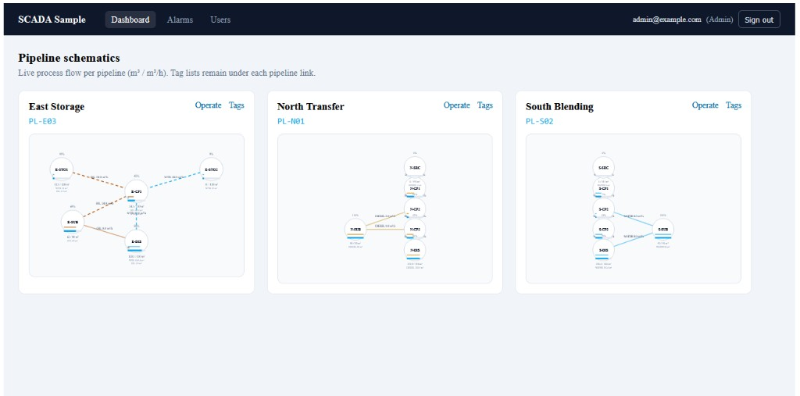

## SCADA Sample Project

A small, opinionated **full-stack SCADA-style sample**: an **Angular 19** SPA that talks to an **ASP.NET Core 8** Web API backed by **SQL Server** (Azure SQL Edge in Docker).  
This repository is intended as a learning/reference project for:

- **Angular 19** (standalone components, routing, HTTP client, SignalR, JWT auth)
- **.NET 8 Web APIs** (Identity, JWT, Swagger)
- **Entity Framework Core with SQL Server**
- **Containerized local database development (Azure SQL Edge / SQL Server in Docker)**

### What the site looks like

After signing in, operators land on a **dashboard of live pipeline schematics**. Each card shows a process graph for one pipeline (tanks, checkpoints, substations, and transfer lines), with fill levels and flow rates updating in real time over SignalR. From there you can open **Operate** for pump/valve control, drill into **Tags**, review **Alarms**, or (as Admin) manage **Users**.



---

## Project Structure

```text
SCADASample/
  README.md
  docker-compose.yml           # Local SQL Server (Azure SQL Edge) container

  SCADASampleApp/              # Angular 19 front-end (SCADA UI)
    package.json               # Scripts: ng serve, ng build, tests
    angular.json               # CLI project, SSR options, dev-server defaults
    src/
      main.ts                  # Browser bootstrap
      app/
        app.config.ts          # Router, HttpClient + auth interceptor, hydration
        app.routes.ts          # Lazy-loaded routes and guards
        core/                  # Cross-cutting: auth, guards, interceptors, SignalR hub helpers
        shell/                 # Main layout (nav, sign-out)
        features/              # Route-level UI: dashboard, pipelines, alarms, admin, login
        models/                # TypeScript shapes for API payloads
      environments/
        environment.ts         # production apiUrl (and file replacement in dev)
        environment.development.ts

  SCADASampleAPI/              # ASP.NET Core Web API (backend)
    SCADASampleAPI.csproj
    Program.cs                 # App bootstrap, DI & middleware
    appsettings.json           # Main configuration (logging, connection string)
    appsettings.Development.json
    Properties/launchSettings.json   # Local HTTP/HTTPS ports (must match Angular apiUrl)

    Controllers/
      AlarmsController.cs      # API endpoint(s) for alarms

    Data/
      ApplicationDbContext.cs  # EF Core DbContext and model configuration

    Models/
      Alarms.cs                # Alarm entity representing SCADA alarms
```

### High-Level Architecture

- **Front-end** (`SCADASampleApp`)
  - **Angular 19** SPA with lazy-loaded **standalone** feature components.
  - **JWT** stored client-side; an **HTTP interceptor** attaches the bearer token to API calls.
  - **@microsoft/signalr** for live tag and process-graph updates (aligned with API hubs).
  - **SSR** is configured in `angular.json` (`main.server.ts`, `server.ts`); day-to-day local work is usually `ng serve` on **http://localhost:4200**.
- **API layer** (`SCADASampleAPI`)
  - ASP.NET Core Web API exposing REST endpoints (pipelines, alarms, process graph, Identity, etc.).
  - Uses **Swagger/OpenAPI** for interactive documentation in development.
- **Data access layer**
  - `ApplicationDbContext` uses **Entity Framework Core** to map C# models to SQL tables.
  - SCADA-oriented entities (tags, alarms, process locations/transfers, etc.) live under `Models/` and `Data/`.
- **Database**
  - SQL Server (via **Azure SQL Edge** image) runs in Docker, configured by `docker-compose.yml`.
  - The API connects via the `DefaultConnection` string in `appsettings.json`.

---

## Technologies Used

- **Languages**
  - C# (via `net8.0` on the backend)
  - TypeScript (Angular front‑end)

- **Backend / Framework**
  - ASP.NET Core 8 Web API (`Microsoft.NET.Sdk.Web`)
  - ASP.NET Core **SignalR** (e.g. `/hubs/process` for live SCADA updates consumed by Angular)
  - Swagger/OpenAPI via:
    - `Microsoft.AspNetCore.OpenApi`
    - `Swashbuckle.AspNetCore`

- **Frontend / Framework**
  - Angular 19 (`@angular/core`, `@angular/router`, `@angular/forms`, standalone components)
  - Angular CLI 19 (dev server, build, SSR toolchain)
  - **@microsoft/signalr** for real-time SCADA updates from the API
  - RxJS, Zone.js

- **Data Access**
  - Entity Framework Core (`DbContext`, `DbSet<T>`)
  - SQL Server / Azure SQL Edge

- **Infrastructure & Tooling**
  - Docker & Docker Compose
  - `docker-compose` v3.8 file format
  - Node.js / NPM (for Angular app)

---

## Prerequisites

- **.NET SDK 8.0+**
  - Verify: `dotnet --version`
- **Node.js 18+ and NPM** (for Angular CLI)
  - Verify: `node --version` and `npm --version`
- **Docker** and **Docker Compose**
  - Verify: `docker --version` and `docker compose version` (or `docker-compose --version`)
- Optional: **SQL client tools** (Azure Data Studio, SQL Server Management Studio, `sqlcmd`, etc.) if you want to inspect the database manually.

---

## Angular front-end (`SCADASampleApp`)

`SCADASampleApp/` is the **operator-facing SCADA UI**: dashboard and pipeline views, live values over SignalR, alarms, login, and (for Admins) user management. It is built as an **Angular 19** application with **lazy-loaded routes** and **route guards** (`authGuard`, `adminGuard`).

### Layout of the Angular source

| Area | Path | Role |
|------|------|------|
| Bootstrap & providers | `src/app/app.config.ts` | Router, `HttpClient` with **`authInterceptor`** (JWT on API calls), client hydration |
| Routes | `src/app/app.routes.ts` | Lazy `loadComponent` entries and child routes under the shell |
| Auth & realtime | `src/app/core/` | `auth.service`, `auth.guard`, `admin.guard`, `auth.interceptor`, `process-hub.service` (SignalR) |
| Chrome | `src/app/shell/` | `MainLayoutComponent` — header nav (Dashboard, Alarms, Users for Admin), sign-out |
| Features | `src/app/features/` | `login`, `dashboard`, `pipeline-detail`, `process-schematic`, `alarms`, `admin-users` |
| API types | `src/app/models/api.models.ts` | Shared TypeScript models for REST payloads |
| API base URL | `src/environments/environment*.ts` | **`apiUrl`** must match the API’s HTTP URL (see below) |

### Main routes (UI)

| Route | Feature | Notes |
|-------|---------|--------|
| `/login` | Login | Unauthenticated entry; JWT obtained here |
| `/` | Dashboard | Default home after login |
| `/pipelines/:id` | Pipeline detail | Per-pipeline SCADA view |
| `/pipelines/:id/process` | Process schematic | SVG process graph, pump control for **Admin/Operator**, live hub updates |
| `/alarms` | Alarms | Alarm list / management in the UI |
| `/admin/users` | User admin | **`adminGuard`** — Admin role only |

### Running the Angular dev server

Start the **database and API first** (sections below), then:

**1. Install dependencies** (from repo root):

```bash
cd SCADASampleApp
npm install
```

**2. Start the dev server** (`package.json` maps **`npm start`** → `ng serve`):

```bash
npm start
```

The dev server listens at **`http://localhost:4200`** by default. Open that URL, sign in, and use the nav in the shell header.

**3. Point the client at the API (`apiUrl`)**

The SPA reads the API base URL from:

- `src/environments/environment.ts` (production build)
- `src/environments/environment.development.ts` (used when serving with the **development** configuration — the default for `ng serve` in this project)

Both files define **`apiUrl`**. This must match the URL your API listens on. The API’s **`Properties/launchSettings.json`** profiles use **`http://localhost:5095`** for HTTP (and **`https://localhost:7196`** for HTTPS on the `https` profile). The checked-in environments use **`http://localhost:5095`** so they line up with the **`http`** launch profile.

If you change ports in `launchSettings.json` or run behind another host, update **`apiUrl`** in the environment files so REST calls and SignalR negotiate against the correct origin.

**4. CORS**

`Program.cs` registers the **`AngularDev`** CORS policy with **`http://localhost:4200`**. If you serve Angular on another origin or port, add it to `WithOrigins(...)` in `SCADASampleAPI/Program.cs` or you will see CORS errors in the browser.

### Build and tests

```bash
cd SCADASampleApp
npm run build          # production build (per angular.json)
npm test               # Karma / Jasmine unit tests
```

---

## Running the Database (Docker)

The repo includes a `docker-compose.yml` that starts a **SQL Server (Azure SQL Edge)** instance configured for local development.

```yaml
services:
  mssql:
    image: mcr.microsoft.com/azure-sql-edge:latest
    container_name: sample-scada-mssql
    environment:
      - SA_PASSWORD=yourStrong(!)Password
      - ACCEPT_EULA=Y
    ports:
      - "1433:1433"
```

### Start the Database

From the repository root (`SCADASample/`), run:

```bash
docker compose up -d
```

If your Docker installation uses the older CLI name, use:

```bash
docker-compose up -d
```

This will:

- Start a container named `**sample-scada-mssql**`
- Expose SQL Server on `**localhost:1433**`

> **Security note:** The `SA_PASSWORD` value in `docker-compose.yml` and `appsettings.json` is intended **only for local development**. Change it for any non-local environment.

### Stop the Database

```bash
docker compose down
```

or

```bash
docker-compose down
```

---

## API Configuration

The main API configuration is in `SCADASampleAPI/appsettings.json`.

Key section:

```json
"ConnectionStrings": {
  "DefaultConnection": "Server=localhost,1433;Database=SCADASampleDB;User Id=sa;Password=yourStrong(!)Password;TrustServerCertificate=True;"
}
```

- **Server**: `localhost,1433` (matches the port published by Docker)
- **Database**: `SCADASampleDB`
- **User Id / Password**: matches the SA credentials configured in `docker-compose.yml`
- **TrustServerCertificate**: `True` to simplify local TLS handling

If you change the password or port in `docker-compose.yml`, update this connection string accordingly.

### EF migrations failed part-way (“already an object named …” or “multiple cascade paths”)

If `dotnet run` stops during `MigrateAsync()` with **There is already an object named** `Tags`, `Alarms`, `AspNetUsers`, etc., the database is usually **half migrated**: some `CREATE TABLE` statements committed, but `__EFMigrationsHistory` was never updated, so the next run tries to create the same objects again.

If you see **Introducing FOREIGN KEY constraint … may cause cycles or multiple cascade paths**, that was a SQL Server rule: `ScadaAlarms` had two cascade paths from `Pipelines`. The project fixes this by using **Restrict** on `ScadaAlarms` → `ScadaTags` (you still need a **clean database** or reset script if a failed run left the DB half-built).

**Fix (pick one):**

1. **Reset the Docker volume** (simplest; wipes all SQL data):

   ```bash
   docker compose down -v
   docker compose up -d
   ```

2. **Run the cleanup script** [`SCADASampleAPI/Data/Scripts/ResetDevDatabase.sql`](SCADASampleAPI/Data/Scripts/ResetDevDatabase.sql) against `SCADASampleDB`, then start the API again.

SCADA tables are intentionally named **`ScadaTags`** and **`ScadaAlarms`** so they do not clash with unrelated tables named `Tags` / `Alarms` that may already exist in the database.

Process graph tables **`ScadaProcessLocations`** and **`ScadaProcessTransfers`** are added the same way. If migrations fail part-way, include those names when cleaning the database, or run [`SCADASampleAPI/Data/Scripts/ResetDevDatabase.sql`](SCADASampleAPI/Data/Scripts/ResetDevDatabase.sql) (it drops process tables before alarms/tags).

### Where are users stored?

ASP.NET Core Identity does not use a table named `Users`. Accounts are in **`AspNetUsers`** (plus **`AspNetRoles`**, **`AspNetUserRoles`**, etc.).

---

## Running the Web API

### 1. Restore and build

From the repository root:

```bash
cd SCADASampleAPI
dotnet restore
dotnet build
```

### 2. Ensure the database container is running

In a separate terminal from the repo root:

```bash
docker compose up -d
```

Confirm the container is running:

```bash
docker ps
```

You should see `sample-scada-mssql` in the list.

### 3. Run the API

From the `SCADASampleAPI/` directory:

```bash
dotnet run
```

Default ports in this repo are set in **`SCADASampleAPI/Properties/launchSettings.json`**:

- **HTTP** profile: `http://localhost:5095` (matches **`apiUrl`** in the Angular environments)
- **HTTPS** profile: `https://localhost:7196` and `http://localhost:5095`

Your machine may differ if you change `launchSettings.json` or use other launch profiles.

### 4. Explore the API (Swagger / OpenAPI)

In **Development** mode, Swagger is enabled by `Program.cs`:

- Navigate to the Swagger UI in your browser, e.g.:
  - `http://localhost:5095/swagger` (HTTP profile)
  - or `https://localhost:7196/swagger` (HTTPS profile)

From there you can:

- Inspect the available endpoints (e.g., weather forecast sample, alarms when implemented)
- Execute requests directly in the browser

---

## Process graph (locations, transfers, simulation)

Each **pipeline** can have a small directed **process graph**: **locations** (tanks/silos with volume and layout coordinates) and **transfers** (pump lines between two locations).

- **Units**: volumes use **m³**; flow rates use **m³/h**. The background service advances volumes using `SyntheticScada:UpdateIntervalSeconds` as the time step (same options as tag simulation).
- **Tables**: `ScadaProcessLocations`, `ScadaProcessTransfers`. **Delete behavior**: transfers use **Restrict** toward locations so SQL Server does not introduce multiple cascade paths from `Pipelines`.
- **Seeding**: [`ProcessGraphSeeder`](SCADASampleAPI/Data/ProcessGraphSeeder.cs) runs after [`ScadaSeeder`](SCADASampleAPI/Data/ScadaSeeder.cs) and adds a **source → mix → discharge** graph for any pipeline that has no locations yet (layout `LayoutX` / `LayoutY` is seed-driven for the SVG schematic). One transfer is seeded with the pump **off** so operators can demonstrate starting it from the UI.
- **REST** (JWT required on all routes below):
  - `GET /api/pipelines/{id}/process-graph` — locations and transfers for drawing the graph.
  - `POST /api/pipelines/{id}/transfers/{transferId}/pump` — body `{ "running": true | false }`. **Roles: Admin or Operator only.**
- **SignalR** hub `/hubs/process` (same as tag updates; pass `?access_token=` when needed):
  - `LocationUpdate` — `pipelineId`, `processLocationId`, `currentVolume`, `capacity`, `lastUpdatedUtc`.
  - `TransferUpdate` — `pipelineId`, `processTransferId`, `currentFlowRate`, `isPumpRunning`, `valveOpen`, `lastUpdatedUtc`.
- **Angular**: route **`/pipelines/:id/process`** — SVG schematic, live hub updates, pump toggles for Admin/Operator (`canOperateProcess()`); Viewers see read-only state.

Existing **tags** and **alarms** remain for ancillary points (temperature, pressure, tank level %, etc.).

---

## Domain Model: Alarms

The `Alarms` entity (`Models/Alarms.cs`) represents a simplified SCADA alarm configuration:

- **AlarmId**: Primary key
- **TagId**: Related tag/point identifier
- **AlarmType**: Type of alarm (e.g., high, low, rate-of-change)
- **SetPoint**: Threshold or setpoint value
- **Severity**: Integer severity level
- **Message**: Human-readable alarm description
- **IsEnabled**: Whether the alarm is active

The `ApplicationDbContext` exposes:

- `DbSet<Alarms> Alarms` – enabling CRUD operations via EF Core and LINQ.

---

## Typical Development Workflow

1. **Start the database**
   - From the repo root: `docker compose up -d`
2. **Run the API**
   - `cd SCADASampleAPI`
   - `dotnet run` (use the **`http`** or **`https`** profile as needed; keep **`apiUrl`** in Angular in sync)
3. **Run the Angular app**
   - `cd SCADASampleApp`
   - `npm install` (first time only)
   - `npm start` → open **`http://localhost:4200`**, sign in, exercise dashboard, pipelines, process view, and alarms
4. **Optional: Swagger**
   - Hit **`/swagger`** on the API URL to try REST calls without the UI
5. **Iterate**
   - **Backend:** entities in `Models/`, `ApplicationDbContext`, controllers, hubs
   - **Front-end:** feature components under `SCADASampleApp/src/app/features/`, shared logic in `core/`, and `environment*.ts` for API URL

---

## Notes & Future Enhancements

- Additional SCADA-style entities (tags, trends, events, historian, etc.) can be added under `Models/` and surfaced via new controllers and Angular features.
- Migrations (`dotnet ef migrations`) can be introduced to version and evolve the database schema as the domain model grows.
- The Angular app can be extended with more screens (trends, reports, role-specific dashboards) while reusing `auth.service`, interceptors, and SignalR patterns in `core/`.

This README will evolve as the sample project expands to cover more SCADA scenarios.